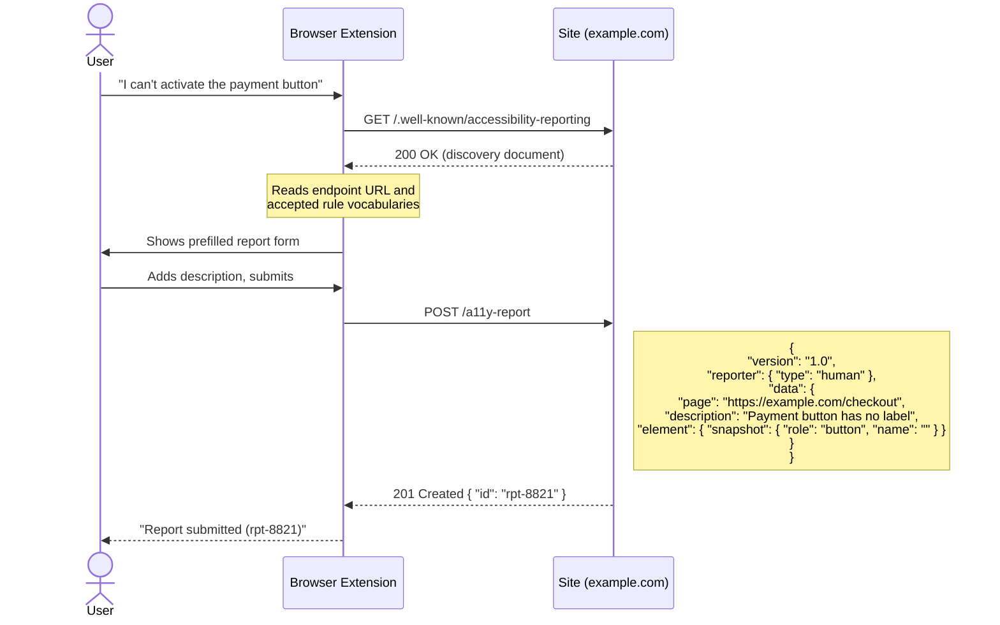
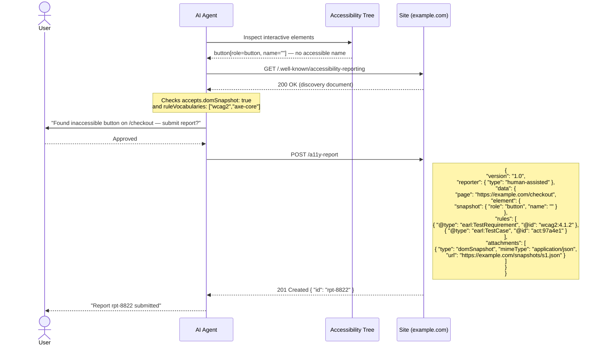

# Well-Known URI for Accessibility Issue Reporting

A proposed standard that lets websites advertise a **machine-readable accessibility issue reporting endpoint** — so users, assistive technologies, browser extensions, and AI agents can all send structured reports directly to site operators.

- [Read the specification](https://autosponge.github.io/well-known-accessibility-report/spec)
- [GitHub repository](https://github.com/AutoSponge/well-known-accessibility-report)

---

## The Core Idea

Any site drops a JSON file at a well-known URL. Any client — human-driven or automated — can discover it and submit structured reports. No prior arrangement needed.

```
https://example.com/.well-known/accessibility-reporting
```

```
┌──────────────────────────────────────────────────────────────┐
│  Site publishes discovery document at well-known URI         │
│                                                              │
│  {                                                           │
│    "version": "1.0",                                         │
│    "reporting": {                                            │
│      "endpoint": "https://example.com/a11y-report",          │
│      "accepts": {                                            │
│        "ruleVocabularies": [                                 │
│          { "name": "WCAG 2.1", "prefix": "wcag2",            │
│            "namespace": "https://www.w3.org/TR/WCAG21/#" }   │
│        ]                                                     │
│      }                                                       │
│    }                                                         │
│  }                                                           │
│                                                              │
│  Reporters GET this → learn the endpoint → POST a report     │
└──────────────────────────────────────────────────────────────┘
```

---

## Two-Step Protocol

```
Reporter                              Operator (site)
   │                                       │
   │  GET /.well-known/accessibility-reporting
   │──────────────────────────────────────►│
   │                                       │
   │  200 OK — discovery document          │
   │◄──────────────────────────────────────│
   │                                       │
   │  (client reads endpoint URL,          │
   │   accepted vocabularies, auth info)   │
   │                                       │
   │  POST /a11y-report  (Report JSON)     │
   │──────────────────────────────────────►│
   │                                       │
   │  201 Created — receipt + ID           │
   │◄──────────────────────────────────────│
```

A `404` on the GET means the site does not support this protocol. Nothing else is needed.

---

## Use Case: Human Reporter

A screen reader user cannot complete a checkout form — the payment button has no accessible name.



The user never leaves the page. The operator receives a structured, actionable report instead of an email.

---

## Use Case: AI Agent

An AI agent browsing on behalf of a user detects an inaccessible widget during an automated audit. It drafts a report, gets user approval, and submits it — including an accessibility tree snapshot.



For fully **automated** scanners there is no user step — the agent fetches, constructs, and submits without human involvement, with `"type": "automated"`.

---

## What a Discovery Document Looks Like

```json
{
  "version": "1.0",
  "reporting": {
    "endpoint": "https://example.com/a11y-report",
    "accepts": {
      "ruleVocabularies": [
        { "name": "WCAG 2.1", "prefix": "wcag2",    "namespace": "https://www.w3.org/TR/WCAG21/#" },
        { "name": "ACT Rules", "prefix": "act",      "namespace": "https://www.w3.org/WAI/standards-guidelines/act/rules/" },
        { "name": "axe-core",  "prefix": "axe-core", "namespace": "https://dequeuniversity.com/rules/axe/" }
      ],
      "attachments": [
        { "type": "domSnapshot" },
        { "type": "screenshot" }
      ]
    }
  },
  "contact": {
    "email": "accessibility@example.com"
  }
}
```

## What a Minimal Report Looks Like

```json
{
  "@context": { "wcag2": "https://www.w3.org/TR/WCAG21/#", "earl": "http://www.w3.org/ns/earl#" },
  "version": "1.0",
  "reporter": { "type": "human" },
  "data": {
    "page": "https://example.com/checkout",
    "description": "The payment button has no accessible name. My screen reader reads nothing when focus lands on it.",
    "element": {
      "snapshot": { "role": "button", "name": "" },
      "locators": [
        { "type": "xpath", "value": "/html/body/main/form/button[2]" }
      ]
    },
    "rules": [
      { "@type": "earl:TestRequirement", "@id": "wcag2:4.1.2" }
    ]
  }
}
```

---

## Who Is This For?

| Role | How they use it |
|---|---|
| **Site operators** | Publish a discovery document; receive structured, actionable reports |
| **Assistive technology vendors** | Add "Report issue to this site" to AT menus |
| **Browser extension authors** | Surface a reporting UI when a site declares support |
| **AI agent developers** | Let agents flag accessibility barriers they detect while browsing |
| **Automated scanner authors** | POST findings per-issue rather than sending PDF reports by email |
| **Standard bodies** | A common substrate that WCAG-EM, EARL, ACT, and WAI-Adapt results can all target |

---

## Design Principles

- **No prior arrangement** — works for any site that drops one file
- **Progressive disclosure** — a minimal report is just a URL and a description; structured rules and attachments are optional
- **Reporter-agnostic** — same endpoint handles human, AT, extension, and agent reporters
- **Operator-controlled** — the discovery document declares exactly what the site accepts
- **Inspired by `security.txt`** (RFC 9116) — the same pattern, applied to accessibility
