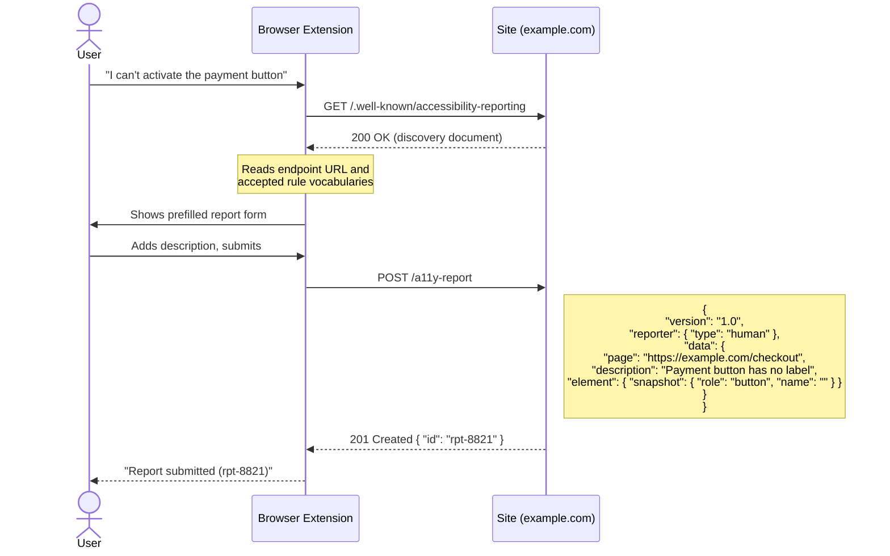
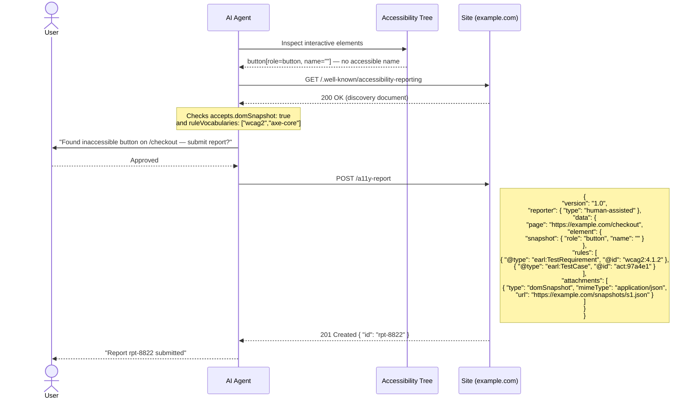
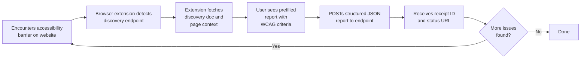
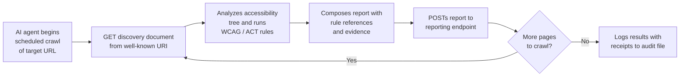
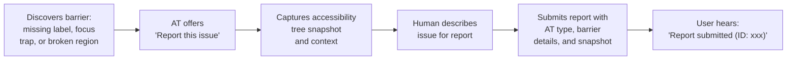

Table of Contents

- [Well-Known URI for Accessibility Issue Reporting](#well-known-uri-for-accessibility-issue-reporting)
  - [The Core Idea](#the-core-idea)
  - [Two-Step Protocol](#two-step-protocol)
  - [Use Case: Human Reporter](#use-case-human-reporter)
  - [Use Case: AI Agent](#use-case-ai-agent)
  - [What a Discovery Document Looks Like](#what-a-discovery-document-looks-like)
  - [What a Minimal Report Looks Like](#what-a-minimal-report-looks-like)
  - [Who Is This For?](#who-is-this-for)
    - [User Journeys](#user-journeys)
      - [Lane 1: Human Reporter (Browser Extension)](#lane-1-human-reporter-browser-extension)
      - [Lane 2: AI (Accessibility) Agent](#lane-2-ai-accessibility-agent)
      - [Lane 3: Assistive Technology User (Screen Reader)](#lane-3-assistive-technology-user-screen-reader)
    - [Operators: Regulatory Alignment Matrix](#operators-regulatory-alignment-matrix)
  - [Design Principles](#design-principles)

---

# Well-Known URI for Accessibility Issue Reporting

A proposed standard that lets websites advertise a **machine-readable accessibility issue reporting endpoint** — so users, assistive technologies, browser extensions, and AI agents can all send structured reports directly to site operators.

- [Read the specification](https://autosponge.github.io/well-known-accessibility-report/spec)
- [GitHub repository](https://github.com/AutoSponge/well-known-accessibility-report)

---

## The Core Idea

Any site drops a JSON file at a well-known URL. Any client — human-driven or automated — can discover it and submit structured reports. No prior arrangement needed.

```
https://example.com/.well-known/accessibility-reporting
```

```
┌──────────────────────────────────────────────────────────────┐
│  Site publishes discovery document at well-known URI         │
│                                                              │
│  {                                                           │
│    "version": "1.0",                                         │
│    "reporting": {                                            │
│      "endpoint": "https://example.com/a11y-report",          │
│      "accepts": {                                            │
│        "ruleVocabularies": [                                 │
│          { "name": "WCAG 2.1", "prefix": "wcag2",            │
│            "namespace": "https://www.w3.org/TR/WCAG21/#" }   │
│        ]                                                     │
│      }                                                       │
│    }                                                         │
│  }                                                           │
│                                                              │
│  Reporters GET this → learn the endpoint → POST a report     │
└──────────────────────────────────────────────────────────────┘
```

---

## Two-Step Protocol

```
Reporter                              Operator (site)
   │                                       │
   │  GET /.well-known/accessibility-reporting
   │──────────────────────────────────────►│
   │                                       │
   │  200 OK — discovery document          │
   │◄──────────────────────────────────────│
   │                                       │
   │  (client reads endpoint URL,          │
   │   accepted vocabularies, auth info)   │
   │                                       │
   │  POST /a11y-report  (Report JSON)     │
   │──────────────────────────────────────►│
   │                                       │
   │  201 Created — receipt + ID           │
   │◄──────────────────────────────────────│
```

A `404` on the GET means the site does not support this protocol. Nothing else is needed.

---

## Use Case: Human Reporter

A screen reader user cannot complete a checkout form — the payment button has no accessible name.



The user never leaves the page. The operator receives a structured, actionable report instead of an email.

---

## Use Case: AI Agent

An AI agent browsing on behalf of a user detects an inaccessible widget during an automated audit. It drafts a report, gets user approval, and submits it — including an accessibility tree snapshot.



For fully **automated** agents there is no user step — the agent fetches, constructs, and submits without human involvement, with `"type": "automated"`.

---

## What a Discovery Document Looks Like

```json
{
  "version": "1.0",
  "reporting": {
    "endpoint": "https://example.com/a11y-report",
    "accepts": {
      "ruleVocabularies": [
        { "name": "WCAG 2.1", "prefix": "wcag2",    "namespace": "https://www.w3.org/TR/WCAG21/#" },
        { "name": "ACT Rules", "prefix": "act",      "namespace": "https://www.w3.org/WAI/standards-guidelines/act/rules/" },
        { "name": "axe-core",  "prefix": "axe-core", "namespace": "https://dequeuniversity.com/rules/axe/" }
      ],
      "attachments": [
        { "type": "domSnapshot" },
        { "type": "screenshot" }
      ]
    }
  },
  "contact": {
    "email": "accessibility@example.com"
  }
}
```

## What a Minimal Report Looks Like

```json
{
  "@context": { "wcag2": "https://www.w3.org/TR/WCAG21/#", "earl": "http://www.w3.org/ns/earl#" },
  "version": "1.0",
  "reporter": { "type": "human" },
  "data": {
    "page": "https://example.com/checkout",
    "description": "The payment button has no accessible name. My screen reader reads nothing when focus lands on it.",
    "element": {
      "snapshot": { "role": "button", "name": "" },
      "locators": [
        { "type": "xpath", "value": "/html/body/main/form/button[2]" }
      ]
    },
    "rules": [
      { "@type": "earl:TestRequirement", "@id": "wcag2:4.1.2" }
    ]
  }
}
```

---

## Who Is This For?

| Role | How they use it |
|---|---|
| **Site operators** | Publish a discovery document; receive structured, actionable reports |
| **Assistive technology vendors** | Add "Report issue to this site" to AT menus |
| **Browser extension authors** | Surface a reporting UI when a site declares support |
| **AI agent developers** | Let agents flag accessibility barriers they detect while browsing |
| **Automated reporter authors** | POST findings per-issue as structured reports instead of emailing PDFs |
| **Standard bodies** | A common substrate that WCAG-EM, EARL, ACT, and WAI-Adapt results can all target |

### User Journeys

#### Lane 1: Human Reporter (Browser Extension)

A person using a browser extension encounters an accessibility barrier, and the extension auto-discovers where to send a structured report — no prior arrangement needed.



#### Lane 2: AI (Accessibility) Agent

An AI agent crawls websites on behalf of a user, discovers a site's reporting endpoint, and automatically submits a structured violation report with full evidence.



#### Lane 3: Assistive Technology User (Screen Reader)

A screen reader user hits a barrier during live usage. Their assistive technology offers to report the issue, captures context automatically, and submits it in-site.



### Operators: Regulatory Alignment Matrix

How each spec feature maps to regulatory requirements across jurisdictions.

| Spec Feature                          | EAA Art. 13                          | EAA Art. 29                | ADA Title II                          | ADA Title III                      | Section 508                   | EN 301 549                      |
|---------------------------------------|--------------------------------------|----------------------------|---------------------------------------|------------------------------------|-------------------------------|---------------------------------|
| Discovery endpoint                    | Enables structured reporting channel | Enables enforcement intake | Structured grievance intake            | Facilitates barrier documentation  | Supports conformance feedback | Aligns with feedback mechanisms |
| Reporting API (POST)                  | Structured issue submission          | Formal complaint mechanism | Formal grievance submission            | Documentation of barriers          | Issue documentation           | Feedback submission             |
| Status tracking (GET)                 | Response time accountability         | Enforcement follow-up      | Grievance follow-up                    | Complaint tracking                 | Remediation tracking          | Follow-up mechanism             |
| Contact info                          | Required contact disclosure          | Enforcement contact        | ADA coordinator (required for 50+ ee) | Voluntary contact point            | Section 508 coordinator       | Contact point                   |
| statement (URL)                       | Art. 13(2) / Annex V requirement     | Referenced in enforcement  | Self-evaluation / transition plan      | Voluntary                          | Required (ACR)                | Accessibility statement         |
| enforcementProcedure                  | N/A                                  | Art. 29 compliance         | Required grievance procedure           | DOJ complaint process              | Agency complaint process      | Enforcement procedure           |
| responseTime                          | Reasonable response required         | Enforcement timeline       | Reasonable timeframe expected          | No defined timeline                | Timely resolution             | Response deadline               |
| Report amend (PUT) / retract (DELETE) | Updated complaint handling           | Complaint modification     | Grievance modification                 | Complaint updates                  | Issue amendments              | Feedback updates                |

---

## Design Principles

- **No prior arrangement** — works for any site that drops one file
- **Progressive disclosure** — a minimal report is just a URL and a description; structured rules and attachments are optional
- **Reporter-agnostic** — same endpoint handles human, AT, extension, and agent reporters
- **Operator-controlled** — the discovery document declares exactly what the site accepts
- **Inspired by `security.txt`** (RFC 9116) — the same pattern, applied to accessibility
